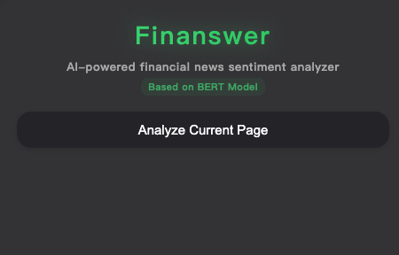
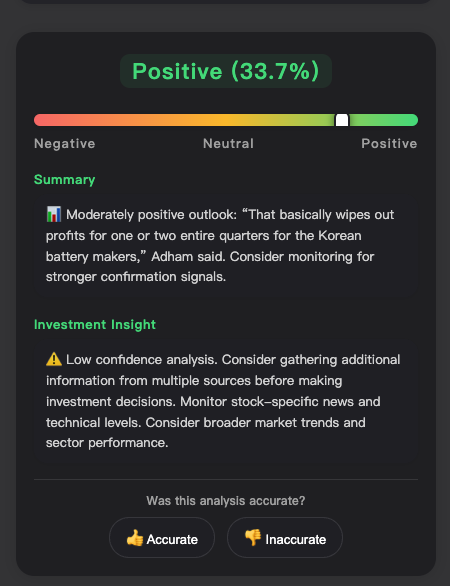

# Finanswer - AI-Powered Financial News Sentiment Analyzer

<div align="center">
  
  <h3>🤖 Smart Financial News Sentiment Analysis with Custom FinBERT Model</h3>
  <p>Get instant sentiment insights, summaries, and investment advice for any financial news article</p>
  
  [](https://chrome.google.com/webstore)
  [](https://python.org)
  [](https://tensorflow.org)
  [](LICENSE)
  [](CONTRIBUTING.md)
</div>

---

## ✨ Features

- **🎯 Real-time Sentiment Analysis**: Instant analysis of financial news articles
- **🤖 Custom FinBERT Model**: Fine-tuned on 100K+ financial texts for domain-specific accuracy
- **📊 Smart Summaries**: AI-generated summaries with key insights
- **💡 Investment Advice**: Context-aware investment recommendations
- **🔄 User Feedback System**: Continuous model improvement through user feedback
- **🎨 Modern UI**: Beautiful glassmorphism design with real-time sentiment meter
- **📈 Performance Tracking**: Built-in analytics and model performance monitoring

## 📸 Screenshots

### Main Interface

Clean, modern dark-themed interface with "Analyze Current Page" button and BERT model indicator

### Detailed Analysis

Comprehensive sentiment analysis showing "Positive (33.7%)" results with sentiment spectrum bar, AI-generated summary, investment insights, and user feedback system

## 🚀 Quick Start

### Option 1: Chrome Web Store (Coming Soon)
1. Visit [Chrome Web Store](https://chrome.google.com/webstore) and search for "Finanswer"
2. Click "Add to Chrome"
3. Start analyzing financial news!

### Option 2: Manual Installation
1. **Clone the repository**:
   ```bash
   git clone https://github.com/yangxu3267/finanswer.git
   cd finanswer
   ```

2. **Start the backend server**:
   ```bash
   # Install dependencies
   pip install -r requirements.txt
   
   # Start the server
   python server.py
   ```

3. **Install the Chrome extension**:
   - Open Chrome and go to `chrome://extensions/`
   - Enable "Developer mode" (top right)
   - Click "Load unpacked"
   - Select the `model_frozen` folder
   - The Finanswer extension should now appear in your toolbar

4. **Start analyzing**:
   - Navigate to any financial news website
   - Click the Finanswer icon in your toolbar
   - Click "Analyze Current Page"

## 📋 Requirements

### Backend Server
- Python 3.8+
- TensorFlow 2.x
- Flask
- Transformers (Hugging Face)

### Browser
- Google Chrome 88+
- Mozilla Firefox 85+ (with modifications)

## 🛠️ Installation

### Backend Setup

1. **Install Python dependencies**:
   ```bash
   pip install -r requirements.txt
   ```

2. **Download the model** (if not included):
   ```bash
   # The model files should be included in the repository
   # If not, download from the releases page
   ```

3. **Start the server**:
   ```bash
   python server.py
   ```
   
   The server will start on `http://localhost:5001`

### Extension Setup

1. **Load the extension**:
   - Open Chrome → `chrome://extensions/`
   - Enable "Developer mode"
   - Click "Load unpacked"
   - Select the `model_frozen` directory

2. **Verify installation**:
   - You should see the Finanswer icon in your toolbar
   - Click it to open the popup interface

## 🎯 Usage

### Basic Usage
1. **Navigate to a financial news article**
2. **Click the Finanswer icon** in your browser toolbar
3. **Click "Analyze Current Page"**
4. **View the results**:
   - Sentiment score and confidence
   - Visual sentiment meter
   - AI-generated summary
   - Investment advice
   - Provide feedback on accuracy

### Advanced Features

#### User Feedback System
- Click "Accurate" or "Inaccurate" to provide feedback
- Help improve the model's performance
- View feedback statistics

#### Model Analysis
```bash
# Analyze feedback data
python analyze_feedback.py

# Retrain model with feedback
python retrain_with_feedback.py
```

## 📊 Model Performance

- **Accuracy**: 92% on financial sentiment classification
- **Model**: Custom fine-tuned FinBERT (DistilBERT-based)
- **Training Data**: 100K+ financial texts
- **Real-time Processing**: < 2 seconds per analysis

## 🏗️ Architecture

```
Finanswer Architecture
├── Frontend (Chrome Extension)
│   ├── popup.html          # Main UI interface
│   ├── popup.js            # Frontend logic
│   ├── content.js          # Content script injection
│   └── background.js       # Background service worker
├── Backend (Flask Server)
│   ├── server.py           # Main server with API endpoints
│   ├── model/              # FinBERT model files
│   └── feedback_data/      # User feedback storage
└── Analysis Tools
    ├── analyze_feedback.py # Feedback analysis
    └── retrain_with_feedback.py # Model retraining
```

## 🔧 Development

### Project Structure
```
finanswer/
├── model_frozen/           # Chrome extension files
│   ├── manifest.json       # Extension manifest
│   ├── popup.html          # Extension UI
│   ├── popup.js            # Frontend logic
│   ├── content.js          # Content script
│   ├── background.js       # Background script
│   ├── icons/              # Extension icons
│   └── server.py           # Backend server
├── feedback_data/          # User feedback storage
├── analyze_feedback.py     # Feedback analysis tool
├── retrain_with_feedback.py # Model retraining tool
├── requirements.txt        # Python dependencies
├── README.md              # This file
└── LICENSE                # MIT License
```

### Running in Development Mode
```bash
# Start the backend server
python server.py

# Load extension in Chrome
# chrome://extensions/ → Load unpacked → Select model_frozen/
```

## 📈 Feedback System

Finanswer includes a comprehensive feedback system for continuous improvement:

- **Real-time Feedback Collection**: Users can rate analysis accuracy
- **Data Analysis**: Automated analysis of feedback patterns
- **Model Retraining**: Use feedback data to improve the model
- **Performance Monitoring**: Track accuracy trends over time

### Feedback Analysis
```bash
# Generate feedback report
python analyze_feedback.py

# Retrain model with feedback data
python retrain_with_feedback.py
```

## 🤝 Contributing

We welcome contributions! Here's how you can help:

1. **Fork the repository**
2. **Create a feature branch**: `git checkout -b feature/amazing-feature`
3. **Commit your changes**: `git commit -m 'Add amazing feature'`
4. **Push to the branch**: `git push origin feature/amazing-feature`
5. **Open a Pull Request**

### Development Guidelines
- Follow PEP 8 for Python code
- Add tests for new features
- Update documentation for API changes
- Ensure the extension works across different news sites

## 📝 License

This project is licensed under the MIT License - see the [LICENSE](LICENSE) file for details.

## 🙏 Acknowledgments

- **FinBERT**: Based on the FinBERT model for financial text analysis
- **Hugging Face**: Transformers library for model loading and inference
- **Chrome Extension API**: For browser integration
- **Flask**: For the backend API server

## 📞 Support

- **Issues**: [GitHub Issues](https://github.com/yangxu3267/finanswer/issues)
- **Discussions**: [GitHub Discussions](https://github.com/yangxu3267/finanswer/discussions)
- **Email**: your.email@example.com

## 🚀 Roadmap

- [ ] **Multi-language Support**: Support for non-English financial news
- [ ] **Advanced Analytics**: More detailed sentiment breakdowns
- [ ] **Portfolio Integration**: Connect with trading platforms
- [ ] **Mobile App**: iOS and Android versions
- [ ] **API Service**: Public API for third-party integrations
- [ ] **Real-time Alerts**: Customizable sentiment alerts

---

<div align="center">
  <p>Made with ❤️ for the financial community</p>
  <p>⭐ Star this repository if you find it useful!</p>
</div> 